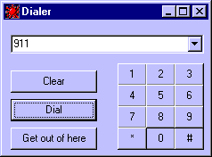



## Tone Dialer

### Description

This code will dial a touch tone phone if the phone is held close to the computer's speaker. A good example of embedding several wave's in a resource file. Enjoy. Sorry, forgot RES file, now included.
 
### More Info
 

             |
---                |---
**Submitted On**   |2000-05-29 06:59:00
**By**             |[Mark Young](https://github.com/Planet-Source-Code/PSCIndex/blob/master/ByAuthor/mark-young.md)
**Level**          |Beginner
**User Rating**    |5.0 (25 globes from 5 users)
**Compatibility**  |VB 5\.0, VB 6\.0
**Category**       |[Miscellaneous](https://github.com/Planet-Source-Code/PSCIndex/blob/master/ByCategory/miscellaneous__1-1.md)
**World**          |[Visual Basic](https://github.com/Planet-Source-Code/PSCIndex/blob/master/ByWorld/visual-basic.md)
**Archive File**   |[CODE\_UPLOAD62105292000\.zip](https://github.com/Planet-Source-Code/mark-young-tone-dialer__1-8440/archive/master.zip)

